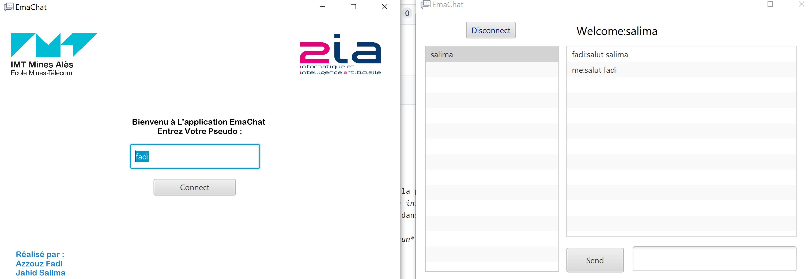

# ChatProjectRMI
Projet du chat avec RMI et JAVA
Réalisé Par : 
- Azzouz Fadi
- Jahid Salima
# Lancement de Projet
- Lancer la commande : *mvn install* sur le dossier du projet si la premiere fois pour générer l'artéfact et le déployer dans le dépôt local, sinon c'est la deuxieme fois lancer la commande *mvn clean install*
- Lancer le Serveur a travers la classe **Server** qui se trouve dans le module client jusqu'a voir sur le console que le serveur est actif.
- Lancer 2 clients Interface avec la commande *mvn clean javafx:run* sur le dossier du module client /module client 
# Le résultat
- Entrer le pseudo sur les deux interfaces :

- On remarque que les deux pseudo rentrés sont dans la liste des clients :

- On selection le client qu'on veut adresser un message et on clique sur send soit sur entrer pour envoyer le message :

- quand on clique sur disconnect le client est automatiquement retirer de la liste des clients :

